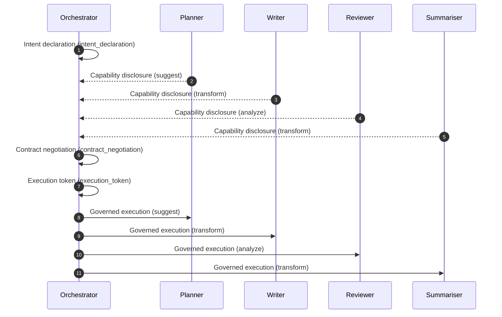
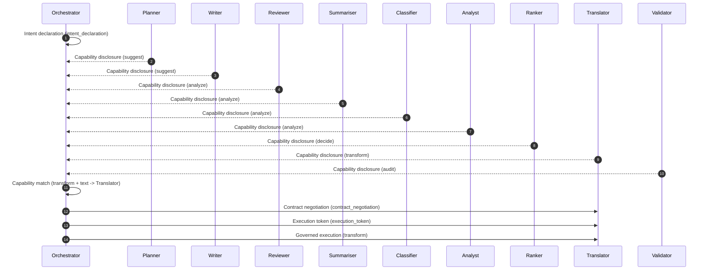

# ICNP Reference Implementation (Ollama agents)

This is a runnable reference implementation of the **Intent-and-Capability Negotiation Protocol (ICNP)**,
demonstrating **visible ICNP message exchange**
between **five Ollama-backed agents**:

- 1x Orchestrator
- 4x Specialist agents (Planner, Writer, Reviewer, Summariser)

It demonstrates:

1. Intent declaration (`intent_declaration`)
2. Capability disclosure (`capability_disclosure`)
3. Contract negotiation (`contract_negotiation`)
4. Execution token issuance (`execution_token`)
5. Governed execution (application-level, outside the schema)

Every ICNP message (phases 1-4) is printed to the console as formatted JSON.
The demo aligns with the canonical docs in `../icnp/` and schemas in `../schemas/`.

---

## Demo communication flow



---

## Prerequisites

1. **Ollama** installed and running locally:
   - Install (macOS): `brew install ollama`
   - Or download from https://ollama.com/download
   - Start the server (if it is not already running): `ollama serve`
   - Default API base URL: `http://localhost:11434`

2. Pull one or more models:
   - Llama 4 Scout: A 17 billion active parameter model featuring a massive
     10 million token context window, designed for handling huge documents and
     complex analysis.
     - `ollama pull llama4:scout`
   - Llama 4 Maverick: A 17 billion active parameter model that uses 128 experts
     in its MoE architecture, excelling in reasoning and coding tasks.
     - `ollama pull llama4:maverick`
   - Mistral 7B: A compact, general-purpose model that is fast to download and
     run locally.
     - `ollama pull mistral:7b`
   - Example alternative:
     - `ollama pull llama3.1:8b`
   - Expected download sizes (approx; from the Ollama model registry):
     - `llama3.1:8b`: ~4.9GB
     - `mistral:7b`: ~4.4GB
     - `llama4:scout`: ~67GB
     - `llama4:maverick`: ~245GB
   - Other quantizations and sizes:
     - https://ollama.com/library/llama3.1/tags
     - https://ollama.com/library/llama4/tags
     - https://ollama.com/library/mistral/tags

3. Python 3.10+ recommended

---

## Install

```bash
cd reference-implementation
python -m venv .venv
source .venv/bin/activate
pip install -e .
```

---

## Run

```bash
python demo_ollama_5_agents.py --model llama3.1:8b
```

Optional:

- Use different models per agent:
  ```bash
  python demo_ollama_5_agents.py \
    --model-planner llama3.1:8b \
    --model-writer mistral:7b \
    --model-reviewer llama3.1:8b \
    --model-summariser llama3.1:8b
  ```

- Dry-run (no Ollama calls; returns canned outputs):
  ```bash
  python demo_ollama_5_agents.py --dry-run
  ```

---

## Additional demo: broadcast, single capability

This demo broadcasts a request to many agents, but only one agent has the
required capability. The orchestrator selects that agent and proceeds with a
contract, token, and execution.

```bash
python demo_ollama_broadcast_single_capability.py --model llama3.1:8b
```



---

## Additional demo: animated intent graph (HTML)

This demo shows a high-level ICNP flow (intent declaration, capability disclosure,
contract negotiation, execution token) with animated edges. It does not display payloads.

```bash
# Option 1: open directly in a browser
open demo_graph_intent_flow.html

# Option 2: serve from the repo root
python -m http.server 8000
# then open http://localhost:8000/reference-implementation/demo_graph_intent_flow.html
```

If you enable GitHub Pages for this repo (main branch, root), you can view it at:

```
https://emmett08.github.io/ICNP_spec_schemas_ref_impl/reference-implementation/demo_graph_intent_flow.html
```

---

## Notes

- Execution outputs are demo-level and are not defined by the ICNP schemas.
- Token strings are demo HMAC-signed payloads; replace with JWT/PKI in real systems.
- In a real system you would likely use asymmetric signatures (e.g. Ed25519) and proper key distribution.
- The message structures match the schemas in `../schemas/`.

---

## Cleanup / Uninstall

Remove downloaded models:

```bash
ollama rm llama4:scout
ollama rm llama4:maverick
```

Uninstall Ollama:

- Homebrew: `brew uninstall ollama`
- macOS app: remove `Ollama.app` from `/Applications`
